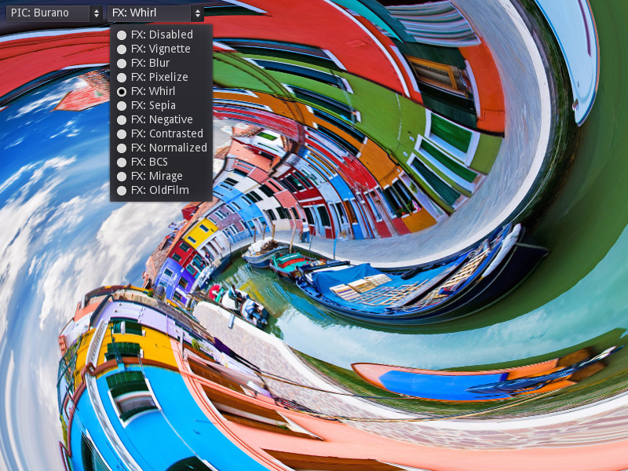
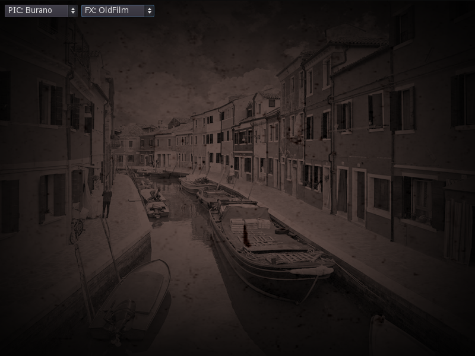

# Screen Space Shaders

Several examples of full screen 2D shader processing.
Many common full-res effects are implemented here for reference.

Language: [GDSL](https://docs.godotengine.org/en/latest/tutorials/shaders/shader_reference/shading_language.html) and C#

Renderer: Vulkan Clustered

## Screenshots

